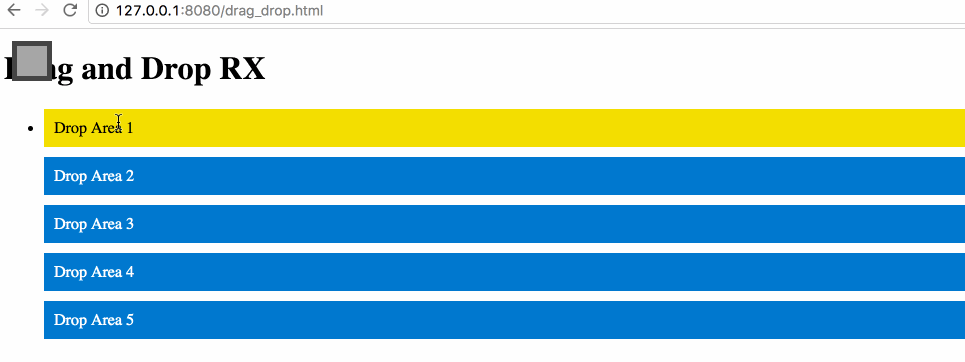

# drag_drop_reactive

An example project to display the drag and drop feature by using Reactive Programming in Javascript using `rxjs`.

### A demo


## Run
```
 git clone
 cd drag_drop_reactive
 npm install
 gulp watch:scripts

```
The above will build the server-side javascript into browser friendly javascript and will watch for any changes.

In another terminal,

```
cd public
live-server
```

The will start an HTTP server and open a new browser with list of files available under `public` directory.
Click on drag_drop.html to load the page.

## Play around

Drag the grey sqaure on top left corner and drag it to the drop areas . You will notice the color change of drop areas from blue to yellow as you drop the sqaure on the drop areas.
They will convert back into blue when you drag the square to another drop area.

